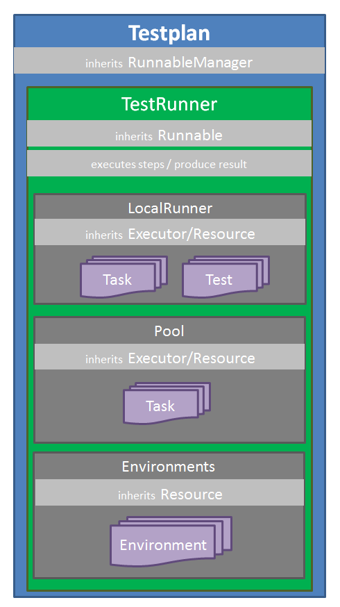
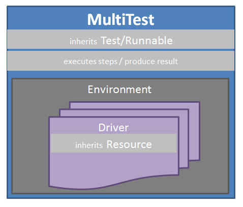

Design doc
==========

Testplan structure is written in way to promote usage of base classes that
provide common functionality and be inherited by more complex classes and that
can be applied to each area: tests, drivers, pools, exporters, etc. Each class
accepts associated configuration and that can inherit the configuration of the
base class as well.

Key areas for ending up to this structure:

  1. Avoid code copy-paste across similar classes.
  2. Provide a way to define relations between classes
     (i.e a Multitest has many drivers, a Testplan has many pools).
  3. Provide a functional .abort() process that takes under consideration the
     hierarchical dependency of objects.
  4. Provide a way to define configuration options for the objects while having
     access to a global configuration.
  5. Ctrl-C and sigterm/sigint handling without hanging.
  6. Common logging and runpath(output files of classes) creation logic.
  7. User programmatic customizations support in various functionality areas.
  8. Parallel and remote execution.
  9. Integration of runtime with other languages or UI tools (i.e Java, React).

Terminology
-----------

Base classes
++++++++++++

Config
``````

:py:class:`~testplan.common.config.base.Config` - configuration objects with
default values or user input with \*\*options after performing a validation stage.
Config objects can inherit other Config objects and alter or define additional
ConfigOption items:

  * Config instances may have parent references that are used to retrieve a
    config option value if this is not present in the current config.
    The ``__getattr__`` method in :py:class:`~testplan.common.config.base.Config`
    contains the rules on whether current or parent config option will be used.
  * ``block_propagation=True`` prevents retrieving the config option from the
    parent.


Entity
``````

:py:class:`~testplan.common.entity.base.Entity` is the first and most important
base class to be used by by classes that:

  * accept configuration that inherit :py:class:`~testplan.common.config.base.Config`
  * have a status with capability to validate transitions (i.e it's legal to go
    from STARTING to STARTED but not from STOPPING to STARTED)
  * need to be able to be aborted and a way to be identified as active (not aborted)
  * need a reference to a "parent" entity to inherit configuration (i.e MultiTest
    parent is the TestRunner)
  * make use of temporary directory for output files (runpath)
  * have dependency entities that need to be aborted before existing entity (i.e
    drivers need to be aborted before Multitest and pools need to be aborted
    before TestRunner)

Resource
````````

:py:class:`~testplan.common.entity.base.Resource` subclass of
:py:class:`~testplan.common.entity.base.Entity` class is used to create
temporary helpful resources that simply need to be STARTED and then STOPPED.
They are NOT creating any result at all. I.e drivers are resources of Multitest
and pools are resources TestRunner.

Runnable
````````

:py:class:`~testplan.common.entity.base.Runnable` subclass of
:py:class:`~testplan.common.entity.base.Entity`  are entities that:

  1. Execute a number of steps
  2. Create and provide a RunnableResult that has a "passed" or not state
  3. May be able to be executed in an interactive mode based on their
     interactive_handler interactive_runner.

RunnableManager
```````````````

:py:class:`~testplan.common.entity.base.RunnableManager` objects will execute
a Runnable object in a seperate thread protecting it from abort signals like
SIGINT/TERM.

Report/Group
````````````

:py:class:`~testplan.common.report.base.Report` and
:py:class:`~testplan.common.report.base.ReportGroup` classes are implementing
the base functionality (merge, flatten, indexing) to create more specialized
reports on top of them like
:py:class:`test <testplan.report.testing.base.TestReport>` reports.

Exporter
````````

Exporters inherit :py:class:`~testplan.common.exporters.BaseExporter` are
responsible to export a created report object (i.e json, xml, pdf, webserver).


Main classes
++++++++++++

Testplan
````````

:py:class:`~testplan.base.Testplan` subclass of
:py:class:`~testplan.common.entity.base.RunnableManager` is the main class to be
used as it manages the main :py:class:`~testplan.runnable.base.TestRunner` instance
that is the implementation of the actual testing framework and that it's
configurable with :py:class:`~testplan.runnable.base.TestRunnerConfig` options and
that provides a :py:class:`~testplan.base.TestplanResult` object representing
the result of the runnable steps execution and also contains a report.

.. note::
    A user can instantiate a plan object directly ``plan = Testplan(**options)``
    and then manually use ``plan.run()`` to execute it
    or decorate a main function with ``@test_plan`` decorator and call it.

:py:class:`~testplan.base.Testplan` accepts a ``parser`` object that will parse
**command line options** and use these **ONLY IF** the values are **NOT**
programmatically hardcoded in \*\*options of the constructor. This is due to the
default arguments of the parser object that makes not obvious to identify if
a parser.attribute is user command line input or just a default value. So
**DO NOT** hardcode values in constructors if you want them to be overwritten by
command line arguments OR parser needs to change to wrap the defaul values into
DefaultValue() objects similar to :py:class:`~testplan.common.config.base.Config`
implementation approach.

After subclassing the base :py:class:`~testplan.common.entity.base.Resource`
and :py:class:`~testplan.common.entity.base.Runnable` classes we can compose
more meaningful classes that compose the actual testing framework components.
So as the following image displays:

  * Testplan has the actual TestRunner testing framework inside it and the
    framework itself is a runnable that executes steps (i.e start/stop pools,
    invoke test result exporters etc).
  * TestRunner framework has Resources that can be started/stopped that may be
    local test runners, pools to execute tasks (callable that return actual tests)
    or the environments container resources to maintain environments of drivers
    outside of tests. (This is useful also when interacting from other languages
    that only need to make use of the environment capability of Testplan.)



MultiTest
`````````

:py:class:`~testplan.testing.multitest.base.MultiTest` is the native python
testing framework supported by Testplan which is a runnable class that executes
steps (i.e start/drivers drivers, execute python testcases) and creates a
MultitestResult that contains a report. The environment is a collection of
drivers that will be accessed from within the testcases.



Driver
``````

:py:class:`~testplan.testing.multitest.driver.base.Driver` base class provide
common functionality to usual drivers like extracting values from logs and
expose attributes via context mechanism so that they can be retrieved at runtime
by other drivers. Also they provide **virtual** functions like
pre/post_start/stop to be able to be customized by users when implementing a
custom behaviour.

Task
````

:py:class:`~testplan.runners.pools.tasks.base.Task` containers are holding the
information for later initialization of actual tests and can be serialized
and dispatched in external python interpreters for the execution.

Pool
````

:py:class:`~testplan.runners.pools.base.Pool` objects are Executor resources of
Tasks and based on their implementation they execute tests differently.
I.e :py:class:`~testplan.runners.pools.process.ProcessPool` executes tests in
external process workers in the same host while
:py:class:`~testplan.runners.pools.remote.RemotePool` executes tests in
remote interpreters in different hosts.

TestReport
``````````

:py:class:`~testplan.report.testing.base.TestReport` (top level Testplan report)
and :py:class:`~testplan.report.testing.base.TestGroupReport` (Multitest,
testsuite, etc..) objects are containing all result information of the tests and
status. They can be serialized and deserialized and this is a requirement as
they are a part of the result objects of runnables that are transferred between
different interpreters in process and remote pools.


Repo structure
--------------

Code
++++

**testplan/common** directory contains common base classes and utilities that
may be used by multiple modules in the repository. Code under this directory
need to be generic enough and must not have any dependency on testplan code
outside *tesptlan/common* directory structure.

**testplan/exporters** directory contains actual implementation of exporters of
reports including test reports to json, xml, pdf, ui formats.

**testplan/report** directory contains actual implementation of reports
including test reports that can be later used by test exporters.

**testplan/runnable** directory contains the main runnable testing framework
functionality including interactive mode.

**testplan/runners** directory contains the test runner and task execution pools
(i.e thread, process, remote) and task and task results definition.

**testplan/testing** directory contains the test runnables inluding MultiTest
that execute testsuites and testcases and produce a test report. It also
includes features for tagging, ordering, listing the cases but not all tests
may support them. The base class of all tests is
:py:class:`~testplan.testing.base.Test` that provides an environment of drivers
and the base class for tests that will execute a binary to run the actual
testcases is :py:class:`~testplan.testing.base.ProcessRunnerTest`.

**testplan/base.py** module contains the main
:py:class:`~testplan.base.Testplan` and @test_plan definitions.

Tests
+++++

**test/functional** directory contains all functional tests organised in a
directory structure mirroring testplan code structure.

    * *test/functional/examples* contains the tests of the downloadable examples.

**test/unit** directory contains all unit tests organised in a directory
structure mirroring testplan code structure.

Docs
++++

**doc/en** directory contains all .rst files documenting all logical components.

**doc/en/api** directory contains the .rst files for automatic API documentation
generation from source code.

Examples
++++++++

**examples** directory contains premade examples demonstrating common use cases
making user adaptation easier. A downloadable example need to have its
corresponding documentation entry in **doc/en/download** directory so that
the users can access it from the documentation webpage.

Execution modes
+++++++++++++++

  * **Local** execution is the default. There are two options:

      1. :py:meth:`plan.add() <testplan.runnable.base.TestRunner.add>`
         that will add a test in the local runner that executes
         tests sequentially in a local thread.
      2. :py:meth:`plan.schedule() <testplan.runnable.base.TestRunner.schedule>`
         that will schedule a task in a pool that can be a
         local thread pool or process pool.

    When adding or scheduling a Test (i.e MultiTest) it is being added/scheduled
    as a whole in a single executor and it's down to its internal implementation
    of how the testsuites/testcases will be executed.

  * **Execution groups** can be used in MultiTest testcases so they can run in
    parallel in groups against the same live environment. Documented
    :ref:`here <testcase_parallelization>`.

  * :ref:`Pools <Pools>` are implementing specific execution strategy and can
    be combined in the same Testplan making it possible for tests to be executed
    in different threads/processes/hosts or a specific cloud platform.
    **Remote** execution can be achieved using :ref:`RemotePool <RemotePool>`
    as documented.

Interactive mode
++++++++++++++++

Testplan :py:class:`runnable <testplan.common.entity.base.Runnable>` entities
support interactive execution based on an API they provide. The idea is that
a user may want to develop tests or debug certain use-cases and re-try
interactively variations of scenarios like restart drivers, edit and re-run a
specific testcase etc. There are 3 main classes that provide this functionality
of runnables:

  1. :py:class:`~testplan.common.entity.base.RunnableIHandler` which is a
     configuration option of runnables that this component **provides the API**
     to add small interactive *operations* and executes them in a loop as long as
     the underlying runnable is *active* (i.e run a test case, start a driver).
     It also starts an HTTP handler if provided in the config like the following.

  2. :py:class:`~testplan.runnable.interactive.http.TestRunnerHTTPHandler` which
     is a config option of :py:class:`~testplan.runnable.interactive.base.TestRunnerIHandler`
     subclass of :py:class:`~testplan.common.entity.base.RunnableIHandler` and
     translates **HTTP requests** and performs the relative *sync* or *async*
     operation based on the API of the corresponding RunnableIHandler.

  3. :py:class:`~testplan.common.entity.base.RunnableIRunner` which is a
     configuration option of runnables that define the interactive mode operations
     that the runnable supports and **yields** the steps of interactive execution.
     In example, for running a MultiTest testsuite, the associated
     :py:class:`~testplan.testing.multitest.base.MultitestIRunner` that inherits
     from base TestIRunner provides the
     :py:meth:`~testplan.testing.multitest.base.MultitestIRunner.run` generator
     to break down the execution in steps of single testcases instead of running
     the testsuite as one operation.

The functional tests that demonstrate interactive mode usage are
`here <https://github.com/Morgan-Stanley/testplan/blob/master/test/functional/testplan/runnable/interactive/test_interactive.py>`_
and the downloadable examples (including jupyter usage) are
`here <https://github.com/Morgan-Stanley/testplan/tree/master/examples/Interactive>`_.

In interactive mode, a common use case is addition of standalone environments
of drivers that are not associated with tests. This makes Testplan useful
but Testing frameworks of other languages that miss this functionality.

And example **Java testplan-interactive** layer that has the capability to
make use of Testplan environment is
`here <https://github.com/Morgan-Stanley/testplan/tree/master/examples/Interactive/Frameworks/Java>`_.

Using the aboe layer, this is the recipe of using Testplan environment in a Java
IDE to test a java application that connects to this environment dynamically:

.. code-block:: java

    // ------------------         -----------------         ------------------
    // |                | ------> |     Java      | ------> |     DriverX    |
    // |     Client     |         |               |         |     DriverY    |
    // |                | <------ |  Application  | <------ |     DriverZ    |
    // ------------------         -----------------         ------------------

    @Before
    public void setUp() throws Exception {
        // Start Testplan interactive mode.
        plan = new TestplanInteractive(..., ...)
        plan.startInteractive();

        // Add and start and environment of drivers.
        plan.addAndStartEnvironment(createEnv("myEnv"));

        // Get a port of the started environment that the Java app needs to
        // connect to.
        Integer serverPort = ((Double) plan.getDriverContextValue(
                "myEnv", "server", "port")).intValue();

        // Make an instance of a java app to be tested connecting it to the
        / started environment.
        JavaApp app = new JavaApp(port=serverPort.intValue());
        ...

        // Add client driver to the environment to connect to local java app.
        plan.addAndStartDriver(
                "myEnv",
                new DriverEntry(
                        "Client",
                        new HashMap<String, Object>(){{
                            this.put("name", "client");
                            this.put("host", app.host);  // Connect to Java app.
                            this.put("port", app.port);  // Connect to Java app.
                        }}));
    }
