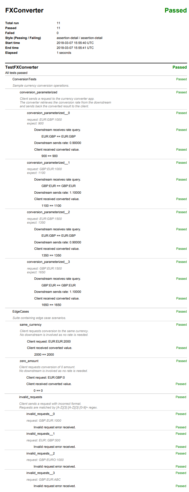

App Driver
**********

Basic Usage
===========

.. _example_app_driver:

Required files:
  - :download:`test_plan.py <../../../examples/App/Basic/test_plan.py>`

test_plan.py
++++++++++++
.. literalinclude:: ../../../examples/App/Basic/test_plan.py

Start Drivers Manually
======================

Required files:
  - :download:`test_plan.py <../../../examples/App/Autostart/test_plan.py>`

test_plan.py
++++++++++++
.. literalinclude:: ../../../examples/App/Autostart/test_plan.py

Custom Application
==================

.. _example_fxconverter:

FXConverter
-----------

Required files:
  - :download:`test_plan.py <../../../examples/App/FXConverter/test_plan.py>`
  - :download:`suites.py <../../../examples/App/FXConverter/suites.py>`
  - :download:`converter.cfg <../../../examples/App/FXConverter/converter.cfg>`
  - :download:`converter.py <../../../examples/App/FXConverter/converter.py>`
  - :download:`driver.py <../../../examples/App/FXConverter/driver.py>`

test_plan.py
++++++++++++
.. literalinclude:: ../../../examples/App/FXConverter/test_plan.py

suites.py
+++++++++
.. literalinclude:: ../../../examples/App/FXConverter/suites.py

converter.cfg
+++++++++++++
.. literalinclude:: ../../../examples/App/FXConverter/converter.cfg

converter.py
++++++++++++
.. literalinclude:: ../../../examples/App/FXConverter/converter.py

driver.py
+++++++++
.. literalinclude:: ../../../examples/App/FXConverter/driver.py

PDF report
++++++++++

*Sample detailed PDF report.*

