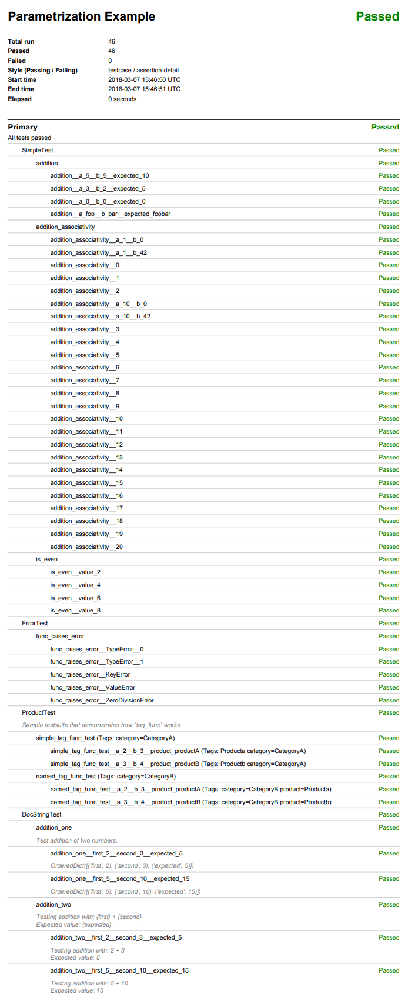

Multitest
*********

.. _example_basic:

Basic
-----

.. _example_basic_initial_context:

Initial Context
+++++++++++++++

Required files:
  - :download:`test_plan.py <../../../examples/Multitest/Basic/Initial Context/test_plan.py>`

test_plan.py
````````````
.. literalinclude:: ../../../examples/Multitest/Basic/Initial Context/test_plan.py


.. _example_basic_name_customization:

Name Customization
++++++++++++++++++

Required files:
  - :download:`test_plan.py <../../../examples/Multitest/Basic/Name Customization/test_plan.py>`

test_plan.py
````````````
.. literalinclude:: ../../../examples/Multitest/Basic/Name Customization/test_plan.py


.. _example_multitest_listing:

Listing
-------

.. _example_multitest_listing_basic:

Basic
+++++

Required files:
  - :download:`test_plan_command_line.py <../../../examples/Multitest/Listing/Basic Listing/test_plan_command_line.py>`
  - :download:`test_plan_programmatic.py <../../../examples/Multitest/Listing/Basic Listing/test_plan_programmatic.py>`

test_plan_command_line.py
`````````````````````````
.. literalinclude:: ../../../examples/Multitest/Listing/Basic Listing/test_plan_command_line.py

test_plan_programmatic.py
`````````````````````````
.. literalinclude:: ../../../examples/Multitest/Listing/Basic Listing/test_plan_programmatic.py

.. _example_multitest_listing_custom:

Custom
++++++

Required files:
  - :download:`test_plan.py <../../../examples/Multitest/Listing/Custom Listers/test_plan.py>`

test_plan.py
````````````
.. literalinclude:: ../../../examples/Multitest/Listing/Custom Listers/test_plan.py

.. _example_multitest_listing_custom_cmd:

Custom with commandline
+++++++++++++++++++++++

Required files:
  - :download:`test_plan_command_line.py <../../../examples/Multitest/Listing/Custom Listers/test_plan_command_line.py>`

test_plan_commandline.py
````````````````````````
.. literalinclude:: ../../../examples/Multitest/Listing/Custom Listers/test_plan_command_line.py

.. _example_multitest_ordering:

Ordering
--------

.. _example_multitest_ordering_basic:

Basic Ordering $ Shuffling
++++++++++++++++++++++++++

Required files:
  - :download:`test_plan_command_line.py <../../../examples/Multitest/Ordering/Basic Ordering and Shuffling/test_plan_command_line.py>`
  - :download:`test_plan_programmatic.py <../../../examples/Multitest/Ordering/Basic Ordering and Shuffling/test_plan_programmatic.py>`

test_plan_command_line.py
`````````````````````````
.. literalinclude:: ../../../examples/Multitest/Ordering/Basic Ordering and Shuffling/test_plan_command_line.py

test_plan_programmatic.py
`````````````````````````
.. literalinclude:: ../../../examples/Multitest/Ordering/Basic Ordering and Shuffling/test_plan_programmatic.py

.. _example_multitest_ordering_custom:

Custom Sorters
++++++++++++++

Required files:
  - :download:`test_plan.py <../../../examples/Multitest/Ordering/Custom Sorters/test_plan.py>`

test_plan.py
````````````
.. literalinclude:: ../../../examples/Multitest/Ordering/Custom Sorters/test_plan.py

.. _example_multitest_ordering_multi:

Multi-level Ordering
++++++++++++++++++++

Required files:
  - :download:`test_plan.py <../../../examples/Multitest/Ordering/Multi-level Ordering/test_plan.py>`

test_plan.py
````````````
.. literalinclude:: ../../../examples/Multitest/Ordering/Multi-level Ordering/test_plan.py


.. _example_multitest_parametrization:

Parametrization
---------------

Required files:
  - :download:`test_plan.py <../../../examples/Multitest/Parametrization/test_plan.py>`

test_plan.py
++++++++++++
.. literalinclude:: ../../../examples/Multitest/Parametrization/test_plan.py

PDF report
++++++++++

*Summary report with no assertion details.*



.. _example_multitest_tagging_filtering:

Tagging and Filtering
---------------------

.. _example_multitest_tagging_basic_filters:

Basic Filters
+++++++++++++

Required files:
  - :download:`test_plan_command_line.py <../../../examples/Multitest/Tagging and Filtering/Basic Filters/test_plan_command_line.py>`
  - :download:`test_plan_programmatic.py <../../../examples/Multitest/Tagging and Filtering/Basic Filters/test_plan_programmatic.py>`

test_plan_command_line.py
`````````````````````````
.. literalinclude:: ../../../examples/Multitest/Tagging and Filtering/Basic Filters/test_plan_command_line.py

test_plan_programmatic.py
`````````````````````````
.. literalinclude:: ../../../examples/Multitest/Tagging and Filtering/Basic Filters/test_plan_programmatic.py

.. _example_multitest_tagging_composite_filters:

Composite Filters
+++++++++++++++++

Required files:
  - :download:`test_plan_command_line.py <../../../examples/Multitest/Tagging and Filtering/Composite Filters/test_plan_command_line.py>`
  - :download:`test_plan_programmatic.py <../../../examples/Multitest/Tagging and Filtering/Composite Filters/test_plan_programmatic.py>`

test_plan_command_line.py
`````````````````````````
.. literalinclude:: ../../../examples/Multitest/Tagging and Filtering/Composite Filters/test_plan_command_line.py

test_plan_programmatic.py
`````````````````````````
.. literalinclude:: ../../../examples/Multitest/Tagging and Filtering/Composite Filters/test_plan_programmatic.py

.. _example_multitest_tagging_custom_filters:

Custom Filters
++++++++++++++

Required files:
  - :download:`test_plan.py <../../../examples/Multitest/Tagging and Filtering/Custom Filters/test_plan.py>`

test_plan.py
````````````
.. literalinclude:: ../../../examples/Multitest/Tagging and Filtering/Custom Filters/test_plan.py

.. _example_multitest_tagging_multi:

Multi level Filtering
+++++++++++++++++++++

Required files:
  - :download:`test_plan.py <../../../examples/Multitest/Tagging and Filtering/Multi-level Filtering/test_plan.py>`

test_plan.py
````````````
.. literalinclude:: ../../../examples/Multitest/Tagging and Filtering/Multi-level Filtering/test_plan.py

Parallel
--------

.. _example_multitest_parallel_basic:

Basic
+++++

Required files:
  - :download:`test_plan.py <../../../examples/Multitest/Parallel/test_plan.py>`
  - :download:`parallel_tasks.py <../../../examples/Multitest/Parallel/parallel_tasks.py>`
  - :download:`resource_manager.py <../../../examples/Multitest/Parallel/resource_manager.py>`

test_plan.py
````````````
.. literalinclude:: ../../../examples/Multitest/Parallel/test_plan.py

parallel_tasks.py
`````````````````
.. literalinclude:: ../../../examples/Multitest/Parallel/parallel_tasks.py

resource_manager.py
```````````````````
.. literalinclude:: ../../../examples/Multitest/Parallel/resource_manager.py


Logging
-------

.. _example_multitest_logging:

Basic
+++++

test_plan_logging.py
````````````````````

.. literalinclude:: ../../../examples/Multitest/Logging/test_plan_logging.py

