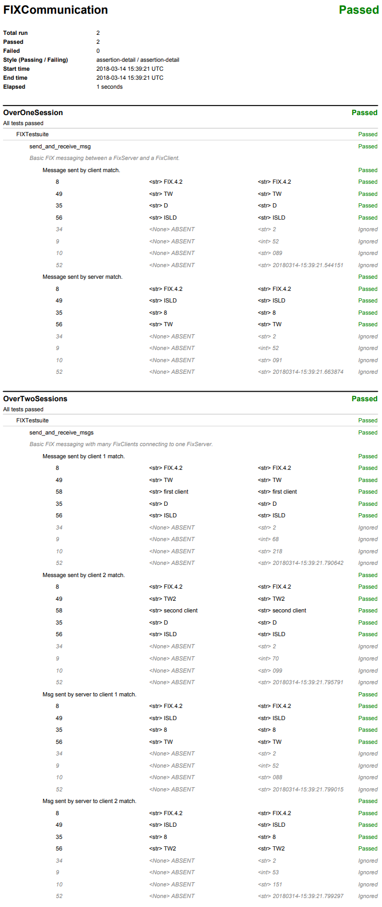

Transports
**********

.. _example_tcp:

TCP
---

Required files:
  - :download:`test_plan.py <../../../testplan/examples/Transports/TCP/test_plan.py>`
  - :download:`tcp_one_connection.py <../../../testplan/examples/Transports/TCP/tcp_one_connection.py>`
  - :download:`tcp_multiple_connections.py <../../../testplan/examples/Transports/TCP/tcp_multiple_connections.py>`

test_plan.py
++++++++++++
.. literalinclude:: ../../../testplan/examples/Transports/TCP/test_plan.py

tcp_one_connection.py
+++++++++++++++++++++
.. literalinclude:: ../../../testplan/examples/Transports/TCP/tcp_one_connection.py

tcp_multiple_connections.py
+++++++++++++++++++++++++++
.. literalinclude:: ../../../testplan/examples/Transports/TCP/tcp_multiple_connections.py

.. _example_zmq:

ZMQ
---

Required files:
  - :download:`test_plan.py <../../../testplan/examples/Transports/ZMQ/test_plan.py>`
  - :download:`zmq_pair_connection.py <../../../testplan/examples/Transports/ZMQ/zmq_pair_connection.py>`
  - :download:`zmq_publish_subscribe_connection.py <../../../testplan/examples/Transports/ZMQ/zmq_publish_subscribe_connection.py>`

test_plan.py
++++++++++++
.. literalinclude:: ../../../testplan/examples/Transports/ZMQ/test_plan.py

zmq_pair_connection.py
++++++++++++++++++++++
.. literalinclude:: ../../../testplan/examples/Transports/ZMQ/zmq_pair_connection.py

zmq_publish_subscribe_connection.py
+++++++++++++++++++++++++++++++++++
.. literalinclude:: ../../../testplan/examples/Transports/ZMQ/zmq_publish_subscribe_connection.py

.. _example_fix:

FIX
---

Required files:
  - :download:`test_plan.py <../../../testplan/examples/Transports/FIX/test_plan.py>`
  - :download:`over_one_session.py <../../../testplan/examples/Transports/FIX/over_one_session.py>`
  - :download:`over_two_sessions.py <../../../testplan/examples/Transports/FIX/over_two_sessions.py>`

test_plan.py
++++++++++++
.. literalinclude:: ../../../testplan/examples/Transports/FIX/test_plan.py

over_one_session.py
+++++++++++++++++++
.. literalinclude:: ../../../testplan/examples/Transports/FIX/over_one_session.py

over_two_sessions.py
++++++++++++++++++++
.. literalinclude:: ../../../testplan/examples/Transports/FIX/over_two_sessions.py

PDF report
++++++++++

*Sample detailed PDF report.*

.. _example_http:

HTTP
----

Required files:
  - :download:`test_plan.py <../../../testplan/examples/Transports/HTTP/test_plan.py>`
  - :download:`http_basic.py <../../../testplan/examples/Transports/HTTP/http_basic.py>`
  - :download:`http_custom_handler.py <../../../testplan/examples/Transports/HTTP/http_custom_handler.py>`
  - :download:`custom_http_request_handler.py <../../../testplan/examples/Transports/HTTP/custom_http_request_handler.py>`
  - :download:`test.txt <../../../testplan/examples/Transports/HTTP/test.txt>`

test_plan.py
++++++++++++
.. literalinclude:: ../../../testplan/examples/Transports/TCP/test_plan.py

http_basic.py
+++++++++++++
.. literalinclude:: ../../../testplan/examples/Transports/HTTP/http_basic.py

http_custom_handler.py
++++++++++++++++++++++
.. literalinclude:: ../../../testplan/examples/Transports/HTTP/http_custom_handler.py

custom_http_request_handler.py
++++++++++++++++++++++++++++++
.. literalinclude:: ../../../testplan/examples/Transports/HTTP/custom_http_request_handler.py

test.txt
++++++++
.. literalinclude:: ../../../testplan/examples/Transports/HTTP/test.txt
