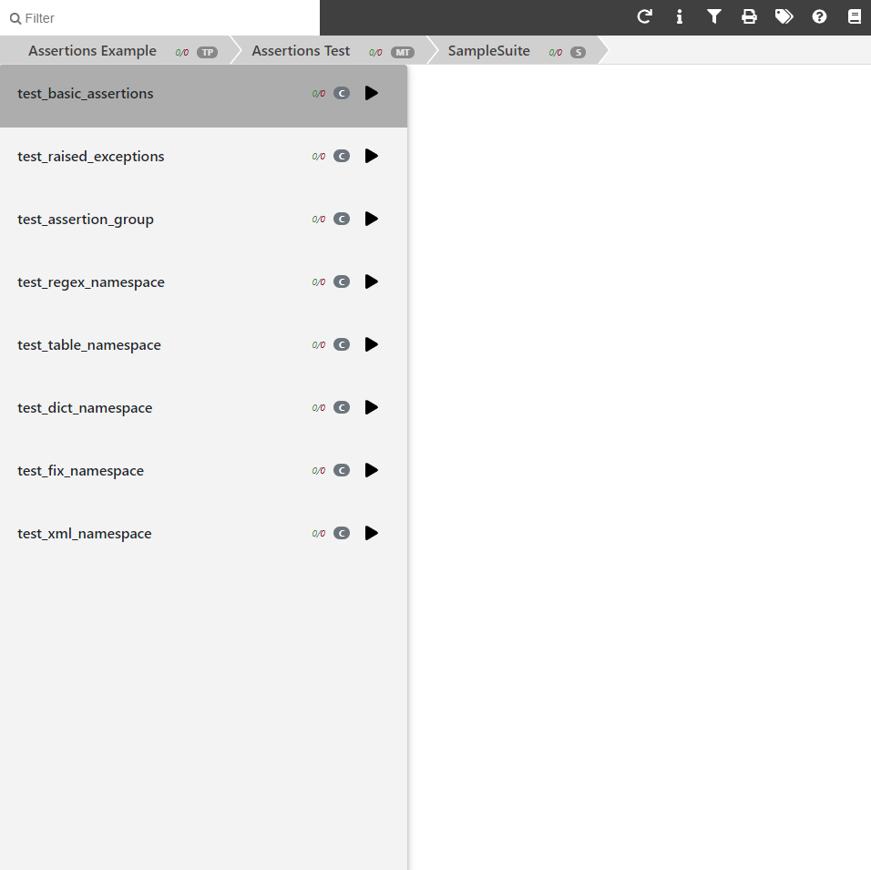
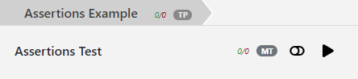

.. _Interactive:

Running Tests Interactively
***************************

Introduction
============

In addition to the default mode, which is to run all selected tests in a single
batch and output results at the end, Testplan supports a second mode of use
known as the "interactive mode". When running in interactive mode, individual
testcases and testsuites may be run on-demand and test environments may
similarly be controlled on-demand.

The basic usage is to run your testplan as normal but with a "-i" flag:

.. code-block:: bash

    $ python test_plan.py -i
    ...
    Interactive Testplan web UI is running. Access it at:
        Local: http://localhost:39514/interactive/
        On Your Network: http://10.2.3.4:39514/interactive/

Why is this useful? The idea is that, while running all tests in a big batch is
fine for fast unit tests or for running longer-running tests on a CI server,
the interactive mode provides a convenient interface for engineers to start up
a testing environment locally and iterate on running testcases against that
environment. To assist with fast iteration, Testplan's interactive mode has an
automatic code-reloading feature which allows testcases to be tweaked, added or
rewritten and then run without having to restart the main Testplan process or
interrupt processes started as part of the test environment.

.. note::

    The interactive mode is currently in a Beta stage and under active
    development. Therefore, features may change in future releases and
    there will likely be some bugs or not-implemented features right now,
    for example the filter box does not yet work. Please bear with us while
    we work through these, and feel free to raise an issue for any bugs
    you find.

How code reloading works
------------------------
The interactive mode only reloads modules under the directory of the test_plan script being run.
The reload happens on reload API and only applies to modules that have either
been modified or have had its dependencies reloaded.

Please note the ``__main__`` module (i.e. test_plan.py) cannot be reloaded.
Because of this, it is recommended that test suites are defined in seperate modules.
Another known limitation is that we are not able to reload module that is under
namespace package, and the workaround is to add dummy __init__.py file.

The steps of the reload process are described below:

* When starting up the interactive mode, testplan builds a graph of dependencies used by the ``__main__`` module. Only dependencies that are within the same directory as the testplan script are included.
  Dependencies are resolved using `modulefinder.ModuleFinder <https://docs.python.org/3/library/modulefinder.html#modulefinder.ModuleFinder>`_
* Dependencies are checked and reloaded on reload API. When reloading modules testplan will:

  * Walk the graph of dependencies starting from ``__main__``.
  * For each module, if any of its dependencies were reloaded or the file has been modified since last reloaded, then reload this module and update __class__ of all suites it defines.

* The interactive report is updated with any changed test cases.

Web UI
======

The main intended way to control Testplan in the interactive mode is via a web
UI provided as part of the Testplan package. When a Testplan is run
interactively, a local web server will be started to serve the UI page and
links to access will be printed. The UI server listens on all IP addresses
owned by your host, so may be accessed via localhost or over your LAN - useful
if you run your Testplan on a Linux server but want to access the web UI from
your Windows desktop for example.

Once loaded, the UI should look something like this:

If you have used the web UI for the batch mode you should find the
interactive UI familiar, with some differences. The navigation structure is
the same - you can click on entries on the navigation bar on the left to dig
down into particular testsuites. The first major difference from the batch UI
is that there are initially no testcase results - no tests have been run yet!
You may run testcases by clicking the "Play" icons next to them in the
navigation bar. Test results will appear in the main central section when
they are available. In addition to running single testcases, you can also run
all testcases in a testsuite or all testsuites in a Test environment in a
similar way.

Test environments will be automatically started as required. However, you may
also start or stop a test environment manually by clicking the toggle icon
found only on top-level Test environments:

Configuration
=============

By default, the interactive web server will listen on an ephemeral port,
however you may override that by passing a port number after the "-i"
option on the command-line:

.. code-block:: bash

    $ python test_plan.py -i 4000
    ...
    Interactive Testplan web UI is running. Access it at:
        Local: http://localhost:4000/interactive/
        On Your Network: http://10.2.3.4:4000/interactive/

Alternatively, a testplan may be programmed to always run in interactive mode.
You may do this by setting the `interactive_port` parameter to any valid port
number, including port 0 to use an ephemeral port.

.. code-block:: python

    @test_plan(
        name="My awesome testplan",
        interactive_port=0,
    )
    def main(plan):
        ...

Interactive API
===============

Testplan's web UI communicates with the backend via a RESTful HTTP API. For
most people this is an implementation detail you don't need to care about.
However, for an advanced user, you may want to design your own client
application which consumes the Testplan API. This could allow for an alternate
UI (Testplan mobile app anyone? We accept PRs). Alternatively, the API could be
used for automated control of Testplan environments and tests from another test
framework entirely - if for example you are a Java developer, you could write
your testcases in Java using JUnit but make API calls to a Testplan process to
control your test environment before and after running tests. There are many
similar possibilities!

When Testplan is started in interactive mode with debug logging enabled, as
well as displaying a link to the web UI it will also display a link to view and
interact with the API schema, using a generated Swagger UI. Take a look at the
schema if you would like to learn more.

.. code-block:: bash

    $ python test_plan.py -di
    ...
    Interactive Testplan API is running. View the API schema:
        Local: http://localhost:36718/api/v1/interactive/
        On Your Network: http://10.174.117.110:36718/api/v1/interactive/
    ...

