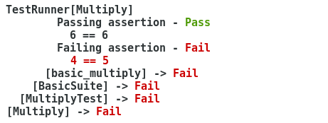
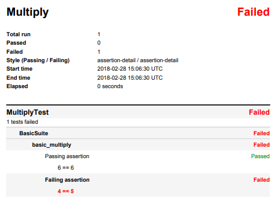

Introduction
************

Testplan is a python testing framework mainly used for integration tests,
application black box testing and has the ability to integrate with external
unit testing frameworks as well, i.e GTest, BoostTest.

Testplan starts a local live interconnected environment and execute test
scenarios against it. It has all the build it mechanisms to dynamically
retrieve processes/services endpoints, instantiate configuration files from
templates based on dynamic resource assignments and provides fixtures
like setup, teardown, after_start, after_stop etc. to customize the tests.

A typical use case is to start an application, connect it to other services,
perform some operations via the application and service
:ref:`drivers <multitest_drivers>` and assert on expected results.

Components
==========

The three main components of a Testplan are:

  1. **Test** (:py:class:`~testplan.testing.multitest.base.MultiTest`,
     :py:class:`~testplan.testing.cpp.gtest.GTest`)
     is defined as a runnable that will be executed
     by :py:class:`~testplan.base.Testplan` and create a
     :py:class:`~testplan.report.testing.base.TestReport`. Multiple tests can be
     added to a Testplan and these are independent entities.

     A Test is a collections of
     :py:func:`@testsuite <testplan.testing.multitest.suite.testsuite>`
     decorated classes that contain
     :py:func:`@testcase <testplan.testing.multitest.suite.testcase>`
     decorated methods in which a user performs the
     :ref:`assertions <Assertions>`.
     The hierarchy used is the following:

     .. code-block:: text

         MultiTest1 (object)
            Testsuite1 (class)
                Testcase1 (method)
                    Assertion1 (callable -> pass/fail)
                    Assertion2
                Testcase2
                    Assertion3
            Testsuite2
                Testcase3
                    Assertion4
                    Assertion5
         MultiTest2
            Testsuite3
                ...

  2. **Execution runtime** to define how and where the tests can be executed.
     By default all tests add added to the default
     :py:class:`~testplan.runners.local.LocalRunner` executor that executes
     them sequentially in the order added. For parallel test execution,
     testplan uses :ref:`pools <Pools>` of workers (i.e
     :py:class:`ThreadPool <testplan.runners.pools.base.Pool>`,
     :py:class:`ProcessPool <testplan.runners.pools.process.ProcessPool>`).

     .. code-block:: python

        @test_plan(name='ThreadPool')
        def main(plan):

            # Add 10 tests for sequential execution.
            for idx in range(10):
                test = MultiTest(name='MultiplyTest',
                                 suites=[BasicSuite()])
                plan.add(test)

            # Schedule tests to a thread pool to execute 10 in parallel.
            pool = ThreadPool(name='MyPool', size=10)
            plan.add_resource(pool)

            for idx in range(10):
                task = Task(target='make_multitest',
                            module='tasks')
                plan.schedule(task, resource='MyPool')

  3. **Output / Report** to control the different representations for the
     test results. The assertions have unique representation in
     :ref:`console <Output_Console>` output as well as in
     :ref:`PDF <Output_PDF>` report. :ref:`XML <Output_XML>` and
     :ref:`JSON <Output_JSON>` output is also supported.

     Access to the :py:class:`~testplan.report.testing.base.TestReport` is
     provided by the :py:class:`~testplan.base.TestplanResult` object that
     is returned by :py:meth:`~testplan.base.Testplan.run` method that is
     invoked by :py:meth:`~testplan.base.test_plan` decorator of ``main()``.

     .. code-block:: python

        @test_plan(name='Multiply', )
        def main(plan):
            test = MultiTest(name='MultiplyTest',
                             suites=[BasicSuite()])
            plan.add(test)

        if __name__ == '__main__':
            res = main()
            print(res)  # TestplanResult
            print(res.report) # TestReport
            sys.exit(not res)

Program
=======

./test_plan.py
--------------

A Testplan application is usually a ``test_plan.py`` file that instantiates a
Testplan object and adds tests to it. A very basic testplan application looks
like this:

Code
++++

.. code-block:: python

    import sys

    from testplan import test_plan
    from testplan.testing.multitest import MultiTest, testsuite, testcase

    def multiply(numA, numB):
        return numA * numB

    @testsuite
    class BasicSuite(object):

        @testcase
        def basic_multiply(self, env, result):
            result.equal(multiply(2, 3), 6, description='Passing assertion')
            result.equal(multiply(2, 2), 5, description='Failing assertion')

    @test_plan(name='Multiply')
    def main(plan):
        test = MultiTest(name='MultiplyTest',
                         suites=[BasicSuite()])
        plan.add(test)

    if __name__ == '__main__':
      sys.exit(not main())

The parts of this applications are:

    1.  Mandatory imports to create the plan object and the tests hierarchy.

        .. code-block:: python

            import sys

            from testplan import test_plan
            from testplan.testing.multitest import MultiTest, testsuite, testcase

    2. Piece of code to be tested.

        .. code-block:: python

            def multiply(numA, numB):
                return numA * numB

    3. The actual assertions organised in testsuite/testcases. The
       :py:class:`result <testplan.testing.multitest.result.Result>`
       argument provides all :ref:`assertions <Assertions>` that accept various
       configuration options
       (i.e :py:meth:`result.fix.match API <testplan.testing.multitest.result.FixNamespace.match>`)
       and have unique rendering representation:

        .. code-block:: python

            @testsuite
            class BasicSuite(object):

                @testcase
                def basic_multiply(self, env, result):
                    result.equal(multiply(2, 3), 6,               # 2 * 3 == 6
                                 description='Passing assertion')
                    result.equal(multiply(2, 2), 5,
                                 description='Failing assertion') # 2 * 2 != 5

    3. A decorated main function that provides a plan object to add the tests.

        .. code-block:: python

            @test_plan(name='Multiply')
            def main(plan):
                test = MultiTest(name='MultiplyTest',
                                 suites=[BasicSuite()])
                plan.add(test)

    3. Logic to exit with non-zero exit code on plan test failure.

        .. code-block:: python

            if __name__ == '__main__':
                sys.exit(not main())

Console output
++++++++++++++

.. code-block:: bash

  $ python ./test_plan.py --verbose

PDF report
++++++++++

.. code-block:: bash

  $ python ./test_plan.py --verbose --pdf report.pdf --pdf-style detailed

Local environment
-----------------

A Test can start a local environment and then run the tests against in. The
following environment:

.. code-block:: text

    ------------------          -----------------          ------------------
    |                | -------> |               | -------> |                |
    |     Client     |          |  Application  |          |    Service     |
    |                | <------- |               | <------- |                |
    ------------------          -----------------          ------------------

could be defined and used in the plan like this:

.. code-block:: python

    @test_plan(name='MyPlan')
    def main(plan):
        test = MultiTest(
                   name='MyTest',
                   suites=[Suite1(), Suite2()],
                   environment=[
                       Service(name='service'),
                       Application(name='app',
                                   port=context('service', '{{port}}'))
                       Client(name='client',
                              port=context('app', '{{port}}'))
                       ])
        plan.add(test)

Before test execution, the environment will start and its parts will be
connected using the context mechanism. Then in will be accessible from within
the testcases making it able to execute real operations and perform assertions
against expected results.

The environment can be accessed using ``env`` argument of the testcases:

.. code-block:: python

    @testcase
    def send_message(self, env, result):
        message = 'Hello'
        env.client.send(message)  # Client sends a message to the application
                                  # and the application should forward it to
                                  # the connected service.
        received = env.service.receive()  # Try to receive the message from the
                                          # service. This can timeout.
        result.equal(received, message,
                     'Message service received.')  # Actual assertion to check
                                                   # that the correct message
                                                   # was received from service.

A list of self-explanatory **downloadable examples** can be found
:ref:`here <download>`.

Configuration
=============

Most of the objects in testplan take ``**options`` as parameters and these are
validated using a ``schema`` at initialization stage.
For example, :py:class:`~testplan.base.Testplan` validates all input options
using a ``schema`` defined in the :py:class:`~testplan.base.TestplanConfig`
that inherits the schema of a
:py:class:`~testplan.common.entity.base.RunnableManagerConfig` and
:py:class:`~testplan.runnable.base.TestRunnerConfig`. In this case,
:py:class:`~testplan.base.Testplan` accepts all arguments of
:py:class:`~testplan.common.entity.base.RunnableManager` entity and
:py:class:`~testplan.runnable.base.TestRunner` entity.

This is to avoid duplication of configuration options in similar components
and enable re-usability and extendability of existing classes.

Example Testplan initialization where all input parameters
(``name``, ``pdf_path``, ``stdout_style``, ``pdf_style``) are part of
:py:class:`~testplan.runnable.base.TestRunnerConfig` schema of
:py:class:`~testplan.runnable.base.TestRunner` entity.

.. code-block:: python

    @test_plan(name='FXConverter',
               pdf_path='report.pdf',
               stdout_style=OUTPUT_STYLE,
               pdf_style=OUTPUT_STYLE)
    def main(plan):
        ...

Command line
============

    Arguments can be provided in a ``test_plan.py`` application:

    Information:
      -h, --help            show this help message and exit
      --list                Shortcut for `--info name`.
      --info                (default: None)

                            "pattern-full" - List tests in `--patterns` / `--tags` compatible format.

                            "name-full" - List tests in readable format.

                            "count" - Lists top level instances and total number of suites & testcases per instance.

                            "pattern" - List tests in `--patterns` / `--tags` compatible format. Max 25 testcases per suite will be displayed.

                            "name" - List tests in readable format. Max 25 testcases per suite will be displayed.

    General:
      --runpath             Path under which all temp files and logs will be created.
      --timeout             Expiry timeout on test execution.
      -i, --interactive     Enable interactive mode. A port may be specified, otherwise the port defaults to 0.
      --pre-start-environments     Enable pre-start of environments in interactive mode. MultiTest names are to be passed as whitespace separated list of strings. Defaults to no pre-start.
      --trace-tests         Enable the tracing tests feature. A JSON file containing file names and line numbers to be watched by the tracer must be specified.
      --trace-tests-output
                            Specify output file for tests impacted by change in Testplan pattern format (see --trace-tests). Will be ignored if --trace-tests is not specified. Default to standard output.
      --xfail-tests         Read a list of known to fail testcases from a JSON file with each entry looks like: {"<Multitest>:<TestSuite>:<testcase>": {"reason": <value>, "strict": <value>} }
      --runtime-data PATH   Historical runtime data which will be used for Multitest auto-part and weight-based Task smart-scheduling with entries looks like:

                            {
                                "<Multitest>": {
                                    | "execution_time": 199.99,
                                    | "setup_time": 39.99,
                                    | "teardown_time": 39.99, // optional
                                },
                            }

      --skip-remaining      {cases-on-failed,cases-on-error,suites-on-failed,suites-on-error,tests-on-failed,tests-on-error}

                            Make Testplan break from the current execution flow and skip remaining iterations at certain level (choose one from all the options). "on-error" make this skip upon exception raised, and "on-failed" make this skip upon both exception raised and test failure. In other words, "on-failed" has higher precedence.

                            Use "cases-on-failed"/"cases-on-error" to skip remaining testcases in the same testsuite when condition is met, execution will resume from the next testsuite.

                            Use "suites-on-failed"/"suites-on-error" to skip remaining testsuites as well in the same Multitest when condition is met, execution will resume from the next Multitest/GTest etc.

                            Use "tests-on-failed"/"tests-on-error" to skip remaining Multitests/GTests etc. as well (i.e. everything remaining) in the current Testplan when condition is met.

                            To skip everything and stop executing all further tests use "tests-on-failed".

    Filtering:
      --patterns            Test filter, supports glob notation & multiple arguments.

                            --patterns <Multitest Name>

                            --patterns <Multitest Name 1> <Multitest Name 2>

                            --patterns <Multitest Name 1> --patterns <Multitest Name 2>

                            --patterns <Multitest Name>:<Suite Name>

                            --patterns <Multitest Name>:<Suite Name>:<Testcase name>

                            --patterns <Multitest Name>:\*:<Testcase name>

                            --patterns \*:<Suite Name>:<Testcase name>
      --patterns-file       Test filter supplied in a file, with one pattern per line.

                            --patterns-file <File>
      --tags                Test filter, runs tests that match ANY of the given tags.

                            --tags <tag_name_1> --tags <tag_name 2>

                            --tags <tag_name_1> <tag_category_1>=<tag_name_2>

      --tags-all            Test filter, runs tests that match ALL of the given tags.

                            --tags-all <tag_name_1> --tags <tag_name 2>

                            --tags-all <tag_name_1> <tag_category_1>=<tag_name_2>

    Ordering:
      --shuffle             {all,instances,suites,testcases}

                            Shuffle execution order
      --shuffle-seed        Seed shuffle with a specific value, useful to
                            reproduce a particular order.

    Reporting:
      --stdout-style        (default: summary)

                            "result-only" - Display only root level pass/fail status.

                            "summary" - Display top level (e.g. multitest) pass/fail status .

                            "extended-summary" - Display assertion details for failing tests, testcase level statuses for the rest.

                            "detailed" - Display details of all tests & assertions.
      --report-filter       Only include testcases with execution result Error (E), Failed (F), Incomplete (I), Passed (P), Skipped (S),
                            Unstable (U), Unknown (X), XFail (A), XPass (B) and XPass-Strict (C) in Testplan report. Use lower-case characters
                            to exclude certain testcases from the report. Use "PS" will select passed and skipped testcases only, and use "ps" will
                            select all the testcases that are not passed and not skipped. Note using upper-case and lower-case letters together
                            is not allowed due to potential ambiguity.
      --omit-passed         Equivalent to "--report-filter=p", cannot be used with "--report-filter" together.
      --omit-skipped        Equivalent to "--report-filter=s", cannot be used with "--report-filter" together.
      --pdf                 Path for PDF report.
      --json                Path for JSON report.
      --xml                 Directory path for XML reports.
      --report-dir          Target directory for tag filtered report output.
      --pdf-style           (default: extended-summary)

                            "result-only" - Display only root level pass/fail status.

                            "summary" - Display top level (e.g. multitest) pass/fail status .

                            "extended-summary" - Display assertion details for failing tests, testcase level statuses for the rest.

                            "detailed" - Display details of all tests & assertions.

      -v, --verbose         Enable verbose mode that will also set the stdout-style option to "detailed".
      -d, --debug           Enable debug mode.
      -b, --browser         Automatically open report in browser.
      -u [UI_PORT], --ui [UI_PORT]
                            Start the web server to view the Testplan UI. A port can be specified, otherwise defaults to None. A JSON report will be saved locally.
      --report-tags         Report filter, generates a separate report (PDF by default)
                            that match ANY of the given tags.

                            --report-tags <tag_name_1> --report-tags <tag_name 2>

                            --report-tags <tag_name_1> <tag_category_1>=<tag_name_2>
      --report-tags-all     Report filter, generates a separate report (PDF by default)
                            that match ALL of the given tags.

                            --report-tags-all <tag_name_1> --report-tags-all <tag_name 2>

                            --report-tags-all <tag_name_1> <tag_category_1>=<tag_name_2>

      --file-log-level      {USER_INFO,CRITICAL,ERROR,WARNING,INFO,DEBUG,NONE}

                            Specify log level for file logs. Set to None to disable file logging.

      --label LABEL         Label the test report with the given name, useful to categorize or classify similar reports (aka "run-id").
      --driver-info         Display drivers startup and teardown information, and visualise driver connections in the report.
      --code                Collects file path, line number and code context of the assertions.

Highlighted features
====================

Some features that should be highlighted are:

  1. Testcase :ref:`tagging <tagging>` for flexible testcase filtering
     and :ref:`multiple reports creation <example_tagged_filtered_pdf>`.

  2. Testcase :ref:`parametrization <parametrization>` to dynamically create
     testcases from input parameters and provide features like dynamic testcase
     name generation, docstring manipulation for better PDF reports and dynamic
     testcase tagging.

  3. Configurable :ref:`output styles <styling_output>` mechanism to fully
     control what is being displayed while tests run.

  4. CI/CD `Jenkins <https://jenkins.io>`_ integration by creating
     :ref:`XML <Output_XML>` result files for the tests using
     :py:class:`~testplan.exporters.testing.xml.XMLExporter`.

  5. Parallel test execution using
     :py:class:`ThreadPool <testplan.runners.pools.base.Pool>`,
     :py:class:`ProcessPool <testplan.runners.pools.process.ProcessPool>` etc.

  6. Ability for the user to provide custom
     :py:class:`TestLister <testplan.testing.listing.BaseLister>`,
     :py:class:`TestSorter <testplan.testing.ordering.TypedSorter>` and
     :py:class:`~testplan.exporters.testing.base.Exporter` components that can be
     configured programmatically.

