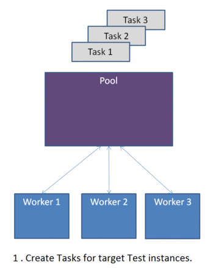

.. _Pools:

Pools
=====

Pools are Test :py:class:`executors <testplan.runners.base.Executor>`
that instantiate an array of
:py:class:`workers <testplan.runners.pools.base.Worker>` that pull and
execute them in parallel. Test instances are generally not serializable so
:py:class:`~testplan.runners.pools.tasks.base.Task` s are being *scheduled* to
the pools instead.

Pools are resources that can be added in a plan using
:py:meth:`~testplan.runnable.TestRunner.add_resource` method of the
:py:class:`plan <testplan.base.Testplan>` object.

.. code-block:: python

    @test_plan(name='PoolDemo')
    def main(plan):
        ...
        pool = Pool(**options)
        plan.add_resource(pool)
        ...

Task / Result
-------------

Task
++++

A Task is an object that holds the path to a target that can be materialized
at runtime and executed by worker instances. For example, if a target function
that creates a MultiTest is in file ``./tasks.py``:

.. code-block:: python

    # ./tasks.py

    def make_multitest():
        test = MultiTest(name='TestName',
                         suites=[Testsuite1(), Testsuite2()],
                         environment=[Server(name='server'), ...])
        return test

the task that holds the information to materialize the MultiTest at runtime
is the following:

.. code-block:: python

    # ./test_plan.py

    task = Task(target='make_multitest',
                module='tasks',
                path=os.path.dirname(os.path.abspath(__file__)))  # same dir

The target function can accept arguments:

.. code-block:: python

    # ./tasks.py

    def make_multitest(index):
        test = MultiTest(name='Test_{}'.format(index),
                         ...)
        return test

and many Test instances can be created from the same target function:

.. code-block:: python

    # ./test_plan.py

    for idx in range(10):
        task = Task(target='make_multitest',
                    module='tasks',
                    path=os.path.dirname(os.path.abspath(__file__)),  # same dir
                    args=(idx,))  # or kwargs={'index': idx}

TaskResult
++++++++++

A :py:class:`~testplan.runners.pools.tasks.base.TaskResult` is the object that
is returned to the pool by the worker and contains either the actual result,
or the error that prevented the execution.

plan.schedule
-------------

:py:meth:`plan.schedule <testplan.runnable.TestRunner>` is used to schedule a
Task to a Pool and once it's scheduled and pool is started, it will be pulled
and executed by a worker.

.. code-block:: python

        # add a pool to the plan
        pool = Pool(name='PoolName', ...)
        plan.add_resource(pool)

        # schedule a task to the pool
        task = Task(target='make_multitest', ...)
        plan.schedule(task, resource='PoolName')

Pool types
----------

The base pool object accepts some
:py:class:`configuration <testplan.runners.pools.base.PoolConfig>` options that
may be vary based on pool implementations.

These are the current built-in pool types that can be added to a plan:

  1. :ref:`Thread pool <ThreadPool>`
  2. :ref:`Process pool <ProcessPool>`

Future work includes the addition of a remote pool to execute the tasks in
multiple remote hosts.

.. _ThreadPool:

ThreadPool
++++++++++

In a thread pool,
:py:class:`workers <testplan.runners.pools.base.Worker>` are started in separate
threads and they pull tasks from the pool using a transport layer that lives in
the same memory space. The workers are materializing the actual Tests, execute
them and send :py:class:`results <testplan.runners.pools.tasks.base.TaskResult>`
back to the main pool.

.. code-block:: python

    from testplan.runners.pools import ThreadPool

    @test_plan(name='ThreadPoolPlan')
    def main(plan):
        # Add a thread pool of 4 workers.
        pool = ThreadPool(name='MyPool', size=4)
        plan.add_resource(pool)

        # Schedule 10 tasks to the thread pool to execute them 4 in parallel.
        for idx in range(10):
            task = Task(target='make_multitest',
                        module='tasks',
                        kwargs={'index': idx}))
            plan.schedule(task, resource='MyPool')

See a downloadable example of a :ref:`thread pool <example_pool_thread>`.

.. _ProcessPool:

ProcessPool
+++++++++++

Similar to the :ref:`thread pool <ThreadPool>`, the worker interpreters are
started in separate processes and communicate with the pool via
:py:class:`ZMQ transport <testplan.runners.pools.child.ZMQTransport>` with TCP
connection using ``localhost``. During this communication process, the Tasks
and TaskResults are being serialized and de-serialized so all they input
arguments need to support that as well.

.. code-block:: python

    from testplan.runners.pools import ProcessPool

    @test_plan(name='ProcessPoolPlan')
    def main(plan):
        # A pool with 4 child process workers.
        pool = ProcessPool(name='MyPool', size=4)
        plan.add_resource(pool)

        # Schedule 10 tasks to the process pool to execute them 4 in parallel.
        for idx in range(10):
            # All Task arguments need to be serializable.
            task = Task(target='make_multitest',
                        module='tasks',
                        path=os.path.dirname(os.path.abspath(__file__)),
                        kwargs={'index': idx})
            plan.schedule(task, resource='MyPool')

See a downloadable example of a :ref:`process pool <example_pool_process>`.

Fault tolerance
---------------

There are some mechanisms enabled to prevent failures of Tests due to system
failures and their behaviour is a part of
:py:class:`pool configuration <testplan.runners.pools.base.PoolConfig>`:

    1. **Worker not responsive**: Workers (excluding Thread workers) are sending
       heartbeat messages back to the pool and the frequency can be set using
       ``worker_heartbeat`` option.
       If worker fails to send a number of heartbeats (``heartbeats_miss_limit``
       option), all tasks assigned to the worker will be reassigned to the pool.
    2. **Task reassign limit**: The maximum number of generally how many times a
       task can be scheduled to a worker can be configured using
       ``task_retries_limit`` option.
    3. **Task reschedule**: A user has the ability to set a custom callable to
       evaluate whether a task should be rescheduled (i.e failed due to a very
       rare system failure). In order to determine that, the callable accepts
       the ``pool`` object and the ``task_result`` which will contain the
       result report. The report may contain an error entry like *out of memory*
       or generally information that upon that the user may decide that the task
       should be rescheduled instead of its result to be used in the final plan
       report.

       .. code-block:: python

           def custom_reschedule(pool, task_result):
               # task_result.result -> TestResult instance
               # task_result.result.report -> TestReportInstance
               ...
               if ..should_reschedule..:
                 return True
               return False

           # Instantiate a pool with custom configuration options.
           pool = ProcessPool(name=pool_name,
                              size=pool_size,
                              worker_heartbeat=2,
                              heartbeats_miss_limit=2)

           # Set custom reschedule callable logic.
           pool.set_reschedule_check(custom_reschedule)

           # Add the pool to the plan.
           pool_uid = plan.add_resource(pool)
