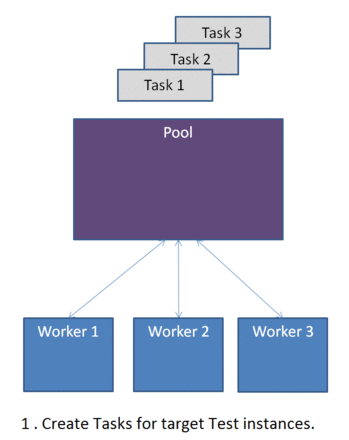

.. _Pools:

Pools
=====

Pools are Test :py:class:`executors <testplan.runners.base.Executor>`
that instantiate an array of
:py:class:`workers <testplan.runners.pools.base.Worker>` that pull and
execute them in parallel. Test instances are generally not serializable so
:py:class:`~testplan.runners.pools.tasks.base.Task` s are being *scheduled* to
the pools instead.

Pools are resources that can be added in a plan using
:py:meth:`~testplan.runnable.base.TestRunner.add_resource` method of the
:py:class:`plan <testplan.base.Testplan>` object.

.. code-block:: python

    @test_plan(name='PoolDemo')
    def main(plan):
        ...
        pool = Pool(**options)
        plan.add_resource(pool)
        ...

Task / Result
-------------

Task
++++

A Task is an object that holds the path to a target that can be materialized
at runtime and executed by worker instances. For example, if a target function
that creates a MultiTest is in file ``./tasks.py``:

.. code-block:: python

    # ./tasks.py

    def make_multitest():
        test = MultiTest(name='TestName',
                         suites=[Testsuite1(), Testsuite2()],
                         environment=[Server(name='server'), ...])
        return test

the task that holds the information to materialize the MultiTest at runtime
is the following:

.. code-block:: python

    # ./test_plan.py

    task = Task(target='make_multitest',
                module='tasks',
                path=os.path.dirname(os.path.abspath(__file__)))  # same dir

The target function can accept arguments:

.. code-block:: python

    # ./tasks.py

    def make_multitest(index):
        test = MultiTest(name='Test_{}'.format(index),
                         ...)
        return test

and many Test instances can be created from the same target function:

.. code-block:: python

    # ./test_plan.py

    for idx in range(10):
        task = Task(target='make_multitest',
                    module='tasks',
                    path=os.path.dirname(os.path.abspath(__file__)),
                    args=(idx,))  # or kwargs={'index': idx}

Pool tasks support sequential reruns until they pass. ``rerun_limit`` counts
additional attempts (0-3); ``rerun_limit=2`` allows three total executions.
A recovered task is reported as ``UNSTABLE`` and the plan can exit successfully.
Exhausted reruns retain their failure. Each attempt has its own report, retaining its own timings, logs and cases.
Reports are never merged across attempts.

.. code-block:: python

    from testplan import Task
    from testplan.testing.common import ALL_CASES

    task = Task(
        target="make_multitest",
        module="tasks",
        rerun_limit=2,
        rerun_entire_task=False,
        rerun_on_different_runner=True,
        case_selection={"SuiteOne": ALL_CASES, "SuiteTwo": ["case_1_param1"]},
    )

The same three rerun options are available on ``@test_plan`` and ``Testplan``,
and through ``--rerun-limit``, ``--[no-]rerun-entire-task`` and
``--[no-]rerun-on-different-runner``. Explicit Task options override global
values; CLI arguments override decorator defaults. Task defaults of ``None``
inherit the global policy. The framework defaults are ``0``, ``False``, ``False``.
``@task_target`` accepts these Task options as well. The existing ``rerun``
argument is deprecated; use ``rerun_limit`` instead. It remains a working
alias and emits a warning when supplied; do not supply both.

``rerun_entire_task=True`` repeats the original selection. With the default ``False``, a
MultiTest rerun executes only failed or unfinished selected cases. Previously
successful cases remain in their original attempt reports. Suite/environment lifecycle failures, strict-order suites,
and unsupported test types fall back to rerunning the current task selection.
If no selected testcase has reached a terminal outcome (passed, expected
failure, unstable, or skipped) and the report is failed or unknown, the rerun
keeps the current task selection unchanged. A group status override alone does not force
a full rerun when some cases have reached terminal outcomes.
Setup and teardown run normally on each attempt. Targets must support repeated
materialization; factories should return fresh tests.

``rerun_on_different_runner=True`` excludes every worker where this task has
failed, while allowing that worker to run other tasks. Busy eligible workers
are waited for. If none remain, the failure is final even if rerun budget
remains. If a rerun was queued but loses its eligible workers before assignment,
it gets a separate ``INCOMPLETE`` / ``NOT_RUN`` report explaining why it could
not start. The previous attempt is preserved once, and the rerun count does
not increase. A worker is identified by its pool and worker ID.

``case_selection`` defaults to the typed sentinel ``ALL_CASES``. Alternatively, it is a
mapping from exact suite IDs to ``ALL_CASES`` or lists of exact testcase IDs,
including expanded parametrized case IDs. ``None`` and glob expressions are
not supported (glob characters in IDs are matched literally). An empty mapping
selects nothing. The subset is applied after existing filters and partitioning.
Subsets require a MultiTest target.

Automatic reruns are supported by pools only; LocalRunner behavior is
unchanged. Case- and suite-level skip strategies apply separately to each
attempt and allow reruns, whether configured globally or on the MultiTest.
Partial reruns include failed and unexecuted cases; explicitly skipped cases
are terminal. The ``tests-on-failed`` and ``tests-on-error`` strategies disable
pool task reruns. Plan timeout continues to limit execution.

Task rerun can be disabled at pool level with ``allow_task_rerun`` parameter.

.. code-block:: python

    # ./test_plan.py

    pool = ThreadPool(name="MyPool", allow_task_rerun=False)

Task can associate with a `weight` value, and it affects task scheduling - the
larger the weight, the sooner task will be assigned to a worker. Default weight
is 0, and tasks with the same weight will be scheduled in the order they are added.

.. code-block:: python

    # ./test_plan.py

    task = Task(target='make_multitest',
                module='tasks',
                path=os.path.dirname(os.path.abspath(__file__)),
                weight=100)

TaskResult
++++++++++

A :py:class:`~testplan.runners.pools.tasks.base.TaskResult` is the object that
is returned to the pool by the worker and contains either the actual result,
or the error that prevented the execution.

plan.schedule
-------------

:py:meth:`plan.schedule <testplan.runnable.base.TestRunner.schedule>` is used to
schedule a
Task to a Pool and once it's scheduled and pool is started, it will be pulled
and executed by a worker.

.. code-block:: python

        # add a pool to the plan
        pool = Pool(name='PoolName', ...)
        plan.add_resource(pool)

        # schedule a task to the pool
        task = Task(target='make_multitest', ...)
        plan.schedule(task, resource='PoolName')

Basic pool types
----------------

The base pool object accepts some
:py:class:`configuration <testplan.runners.pools.base.PoolConfig>` options that
may be vary based on pool implementations.

These are the current built-in pool types that can be added to a plan:

  1. :ref:`Thread pool <ThreadPool>`
  2. :ref:`Process pool <ProcessPool>`
  3. :ref:`Remote pool <RemotePool>`

.. _ThreadPool:

ThreadPool
++++++++++

In a thread pool,
:py:class:`workers <testplan.runners.pools.base.Worker>` are started in separate
threads and they pull tasks from the pool using a transport layer that lives in
the same memory space. The workers are materializing the actual Tests, execute
them and send :py:class:`results <testplan.runners.pools.tasks.base.TaskResult>`
back to the main pool.

.. code-block:: python

    from testplan.runners.pools import ThreadPool

    @test_plan(name='ThreadPoolPlan')
    def main(plan):
        # Add a thread pool of 4 workers.
        pool = ThreadPool(name='MyPool', size=4)
        plan.add_resource(pool)

        # Schedule 10 tasks to the thread pool to execute them 4 in parallel.
        for idx in range(10):
            task = Task(target='make_multitest',
                        module='tasks')
            plan.schedule(task, resource='MyPool')

See a downloadable example of a :ref:`thread pool <example_pool_thread>`.

.. _ProcessPool:

ProcessPool
+++++++++++

Similar to the :ref:`thread pool <ThreadPool>`, the worker interpreters are
started in separate processes and communicate with the pool via
:py:class:`ZMQ transport <testplan.runners.pools.child.ZMQTransport>` with TCP
connection using ``localhost``. During this communication process, the Tasks
and TaskResults are being serialized and de-serialized so all they input
arguments need to support that as well.

.. code-block:: python

    from testplan.runners.pools.process import ProcessPool

    @test_plan(name='ProcessPoolPlan')
    def main(plan):
        # A pool with 4 child process workers.
        pool = ProcessPool(name='MyPool', size=4)
        plan.add_resource(pool)

        # Schedule 10 tasks to the process pool to execute them 4 in parallel.
        for idx in range(10):
            # All Task arguments need to be serializable.
            task = Task(target='make_multitest',
                        module='tasks',
                        path='.')
            plan.schedule(task, resource='MyPool')

See a downloadable example of a :ref:`process pool <example_pool_process>`.

.. _RemotePool:

RemotePool
++++++++++

Remote pool is using ssh to start remote worker interpreters that are
communicating with the local pool with the
:py:class:`ZMQ <testplan.runners.pools.child.ZMQTransport>` transport as well.
During this process, the local workspace will be transferred to the remote
workers (if needed), a Python runtime will be setup on the remote workers, and
the workers will start local 'thread' or 'process' pools, based on their
configuration.

.. code-block:: python

    from testplan.common.remote.remote_runtime import PipBasedBuilder
    from testplan.runners.pools.remote import RemotePool

    @test_plan(name='RemotePoolPlan')
    def main(plan):
        # A pool with 2 remote workers.
        # One with 2 local workers and the other with 1.
        # Remote runtime will be setup via pip, i.e. export locally installed
        # packages and install them on remote host.
        pool = RemotePool(name='MyPool',
                          hosts={'hostname1': 2,
                                 'hostname2': 1},
                          remote_runtime_builder=PipBasedBuilder())
        plan.add_resource(pool)

        # Schedule 10 tasks to the remote pool to execute them 3 in parallel.
        for idx in range(10):
            # All Task arguments need to be serializable.
            task = Task(target='make_multitest',
                        module='tasks',
                        path='.')
            plan.schedule(task, resource='MyPool')

See a downloadable example of a :ref:`remote pool <example_pool_remote>`.

Fault tolerance
---------------

There are some mechanisms enabled to prevent failures of Tests due to system
failures and their behaviour is a part of
:py:class:`pool configuration <testplan.runners.pools.base.PoolConfig>`:

    1. **Worker not responsive**: Workers (excluding Thread workers) are sending
       heartbeat messages back to the pool and the frequency can be set using
       ``worker_heartbeat`` option.
       If worker fails to send a number of heartbeats (``heartbeats_miss_limit``
       option), all tasks assigned to the worker will be reassigned to the pool.
    2. **Task retry**: If a worker dies while running a task, testplan will
       restart the worker and retry the task (for 2 times max). Note that this
       retry behavior doesn't have to do with the Task's rerun setting.

.. _Multitest_parts_scheduling:

MultiTest parts scheduling
--------------------------

A Task that returns a MultiTest can be scheduled in parts in one or more pools.
Each MultiTest will have its own environment and will run a subtotal of testcases
based on which part of the total number of parts it is. So each MultiTest part will
produce its own report entry.

To split a MultiTest task into several parts, we can provide a tuple of 2 elements
as a parameter, the first element indicates the sequence number of part, and the
second one is the number of parts in total. For the tuple (M, N), make sure that
N > 1 and 0 <= M < N, where M and N are both integers.

.. code-block:: python

    from testplan.runners.pools import ThreadPool

    @test_plan(name='ThreadPoolPlan')
    def main(plan):
        # Add a thread pool of 3 workers.
        # Also you can use process pool or remote pool instead.
        pool = ThreadPool(name='MyPool', size=3)
        plan.add_resource(pool)

        # Schedule 10 tasks to the thread pool.
        # A parameter `part_tuple` is provided to indicate which part it is.
        for idx in range(10):
            task = Task(target='make_multitest',
                        module='tasks',
                        kwargs={'part_tuple': (i, 10)})
            plan.schedule(task, resource='MyPool')

Scheduled MultiTest parts will appear as separate entries in the report (e.g.
``MTest - part(0/3)``, ``MTest - part(1/3)``, ``MTest - part(2/3)``). To view
them as a single merged report, use the merge parts toggle in the UI.

See a downloadable example of :ref:`MultiTest parts scheduling <example_multiTest_parts>`.

.. _task_discover:

Task discover
-------------

For some projects, user may find task target definition (e.g the make_multitest
function) and ``plan.schedule`` call become rather repetitive. To reduce boilerplate
code, :py:meth:`@task_target <testplan.runners.pools.tasks.base.task_target>` and
:py:meth:`plan.schedule_all <testplan.runnable.base.schedule_all>` are introduced
to do task discovery.

.. code-block:: python

    plan.schedule_all(
        path=".",
        name_pattern=r".*tasks\.py$",
        resource="MyPool",
    )

In the code above, testplan will go look for @task_target decorated functions
in modules that matches the ``name_pattern`` under current working directory.

.. code-block:: python

    @task_target
    def make_multitest():
        # A test target shall only return 1 runnable object
        test = MultiTest(name="MTest", suites=[Suite()])
        return test

Once found, task object will be created from the target, and scheduled to pool.
It is possible to create multiple task objects out of one target with
`parameters` specified:

.. code-block:: python

    @task_target(
        parameters=(
            # positional args to be passed to target, as a tuple or list
            ("MTest1", None, [SimpleSuite1, SimpleSuite2]),
            # keyword args to be passed to target, as a dict
            dict(
                name="MTest2-1",
                part_tuple=(0, 2),
                suites=[ComplicatedSuite],
            ),
            dict(
                name="MTest2-2",
                part_tuple=(1, 2),
                suites=[ComplicatedSuite],
            ),
        ),
        # additional arguments of Task class
        rerun_limit=1,
        weight=1,
    )
    def make_multitest(name, part_tuple=None, suites=None):
        # A test target shall only return 1 runnable object
        test = MultiTest(
            name=name, suites=[cls() for cls in suites], part=part_tuple
        )
        return test

The code above specifies a collections of parameters in `@task_target`, and each
entry will be used create one task - thus 3 tasks will be created from the target.

For a complete and downloadable example, see :ref:`here <example_discover>`.

.. _auto_part:

Auto-Part and Smart Scheduling
------------------------------

This feature allows ``schedule_all()`` to optimize testplan overall execution time based on historical runtime data. It is
enabled by providing runtime data like following via ``--runtime-data`` command line argument:

.. code-block:: text

    {
        "<Multitest>": {
            "execution_time": 199.99,
            "setup_time": 39.99,
            "teardown_time": 0,
            "testcase_count": 10
        },
        ......
    }

The optimization goal is to create just enough number of pool size and allow all tests to finish as soon as possible.
This is achieved by 3 technics:

1. Auto-part: automatically slice multitests discovered from @task_target with ``multitest_parts="auto"`` argument into
optimal number of parts subject to ``auto_part_runtime_limit`` - default to 30 minutes.

.. code-block:: python

    @task_target(multitest_parts="auto")
    def make_multitest():
        # A test target shall only return 1 runnable object
        test = MultiTest(name="MTest", suites=[Suite()])
        return test

2. Weight-based scheduling: each multitest (part) will be associated with a weight value that represents historical
runtime. Multitest (part) with larger weight will be scheduled with higher priority.

3. Auto-size: if the target pool is specified to have ``"auto"`` size, ``schedule_all()`` will calculate a right number
of pool size so that all tests finishes within ``plan_runtime_target`` - default to 30 minutes.

.. code-block:: python

    # Enable smart-schedule pool size
    pool = ProcessPool(name="MyPool", size="auto")

    # Add a process pool test execution resource to the plan of given size.
    plan.add_resource(pool)

    # Discover tasks and calculate the right size of the pool based on the weight (runtime) of the
    # tasks so that runtime of all tasks meets the plan_runtime_target.
    plan.schedule_all(
        path=".",
        name_pattern=r".*task\.py$",
        resource="MyPool",
    )

To tune the smart scheduling behavior, override ``auto_part_runtime_limit`` and ``plan_runtime_target`` default
in ``@test_plan`` decorator.

``auto_part_runtime_limit`` and ``plan_runtime_target`` can also take "auto" as input, then it will try to derive a
reasonable limit and finish testplan execution asap.

For a complete and downloadable example, see :ref:`here <example_auto_part>`.
